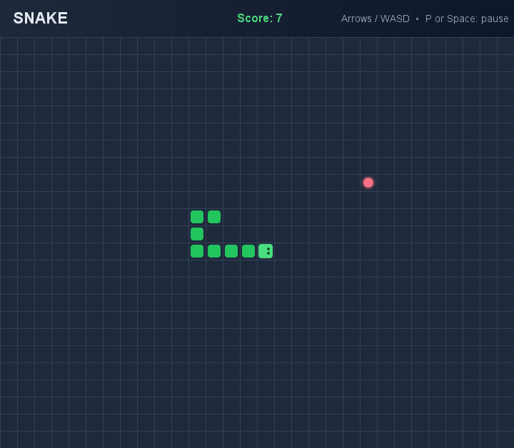

# 🐍 Java Snake Game

A polished, lightweight Snake game built with **Java Swing**. Guide the snake to the food, grow as long as possible, and avoid the walls and your own tail.



## ✨ Features

- Smooth keyboard-controlled gameplay
- Arrow keys and `WASD` support
- Score tracking
- Random food placement
- Wall and self-collision detection
- Pause and resume mode
- Game-over screen with quick restart
- No external libraries required

## ▶️ Run the game

### Recommended: Windows launcher

From this `outputs` folder, double-click `run-snake.cmd`, or run:

```powershell
.\run-snake.cmd
```

The launcher uses the bundled Java runtime automatically.

### Run manually with a JDK

```powershell
javac SnakeGame.java
java SnakeGame
```

Java JDK 8 or newer is required for manual compilation.

## 🎮 Controls

| Key | Action |
| --- | --- |
| `↑` `↓` `←` `→` | Move the snake |
| `W` `A` `S` `D` | Move the snake |
| `P` or `Space` | Pause / resume |
| `R` | Restart after game over |

## 📁 Files

| File | Description |
| --- | --- |
| `SnakeGame.java` | Complete Java Swing source code |
| `run-snake.cmd` | Windows launcher and compiler script |
| `SnakeGamePreview.png` | Game screenshot |
